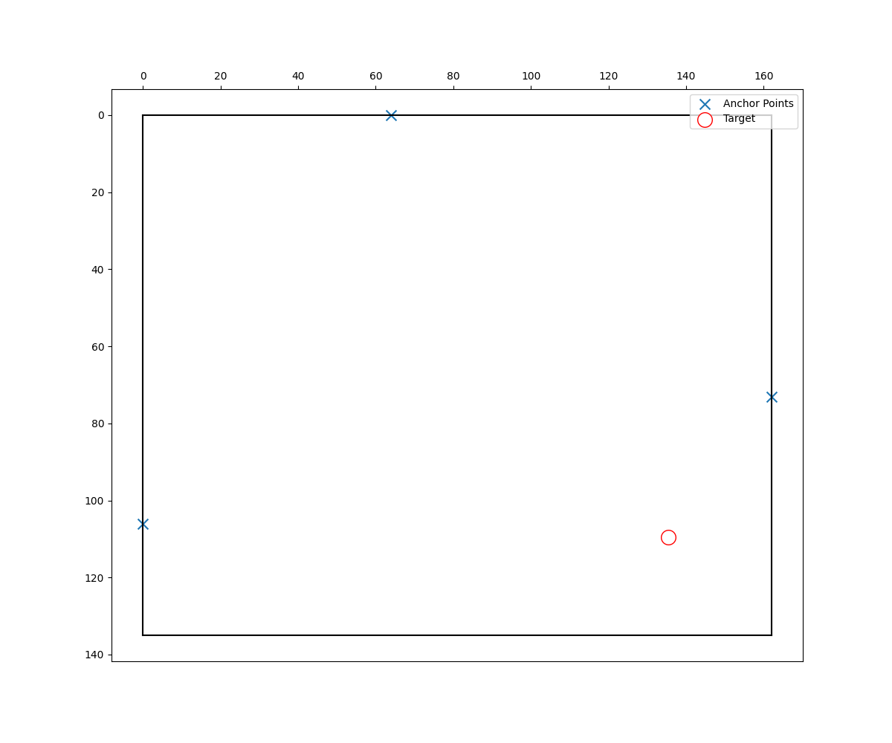

# Table of Contents
* Abstract
* [Introduction](#1-introduction)
* [Related Work](#2-related-work)
* [Technical Approach](#3-technical-approach)
* [Evaluation and Results](#4-evaluation-and-results)
* [Discussion and Conclusions](#5-discussion-and-conclusions)
* [References](#6-references)

# Abstract

Device-Free Wireless Sensing (DFWS) is a newly established field of research aiming at using ubiquitous wireless signals for not only communication but also sensing purpose. WiFi, one of the most popular wireless technology nowadays, is paid especially more attention. The novelty and feasibility of DFWS lies in the insight that human movement near a wireless device makes impact to the wireless channel. By monitoring the variation of wireless channel, researchers may be able to extract information about human movement. As a result, users do not need to wear extra devices to learn information that facilitate their life. In this work, we use ESP32 as an embedded platform to explore DFWS for human motion detection. Our tasks can be divided into three folds according to the sensing precision and difficulty: human motion detection, localization and human respiration rate estimation. We leverage the newly released functionality of ESP32 to access the Channel State Information (CSI) in application layer. And utilized a newly discovered property, "Polite WiFi", to enable connectionless WiFi sensing. Our results demonstrates the feasibility of human motion detection using CSI amplitude and localization using Time-of-Flight (ToF) estimation. However, the respiration rate estimation calls for more fine-grained information. We looked into CSI phase and did some analysis for resolving Carrier Frequency Offset (CFO). 

# 1. Introduction

This section should cover the following items:

> Motivation & Objective: What are you trying to do and why? (plain English without jargon)

Sensing use WiFi has caught a lot of attention recently. The popularization of WiFi network and emerging WiFi-enabled IoT devices promise a great market for products that capable of extracting useful information from ubiquitous WiFi signals. The rationale of this technology lies in that human motion near a WiFi-enabled device varies the WiFi signal. By monitoring the signal, it is possible to extract information about the human motion. In this work, we turned ESP32, a commercial of-the-shelf embedded development board, into a WiFi-based motion sensor. Our tasks are divided into three folds based on sensing precision and difficulty. We first looked into human motion detection, which aims at detecting whether there is a motion happens nearby the ESP32 device. Then, we proceeded to deploy multiple sensors to enable indoor localization. Finally, we tried to estimate the respiration rate of a human near a WiFi-enabled device. 

> State of the Art & Its Limitations: How is it done today, and what are the limits of current practice?

Device-Free Wireless Sensing (DFWS) is a popular research area. Researchers have attempted to use various wireless technologies to learn information from signals over the air, including Ultra-Wide Band (UWB),Frequency-Modulated Continuous-Wave (FMCW) Radar, Bluetooth, WiFi and even millimeter Wave, etc.. Among those technologies, WiFi is the most promising one, given its wide-deployed infrastructure and simple protocol.

WiFi sensing has the benefit of low deployment cost, low privacy concerns and through-wall sensing capability that cannot be replaced by other technologies such as camera. However, the state-of-the-art WiFi sensing products either requires special hardware and software to access Channel State Information (CSI), or calls for stable connections established between Access Point (AP) and client. Their system complexity and vulnerable assumptions hinder the practical deployment of such systems.  

> Novelty & Rationale: What is new in your approach and why do you think it will be successful?

In this work, we leverage the newly-released functionality of ESP32 that enable the access to CSI from application layer, which significantly reduces the cost of deployment. We also exploit a newly-discovered property, named "Polite WiFi", that enables ESP32 to get WiFi packets from any WiFi enabled devices without establishing WiFi connection. We believe that a simple system can be built exclusively on the basis of ESP32 modules to make the deployment more practical. 

> Potential Impact: If the project is successful, what difference will it make, both technically and broadly?

This project will demonstrate the feasibility of using ESP32 as a platform for WiFi sensing and evaluate the precision that we can achieve for various applications. During the exploration, we will be solving lots of technical challenges that would be helpful for inspiring future wireless sensing research. Broadly, the whole system will be more practical and deployable than the prior proposed systems, which gives it great commercial potential in providing important information for decision making.

> Challenges: What are the challenges and risks?

Three challenges comes with three levels of precision we want to achieve. 
1. Human motion detection: It requires a high rate of packets being processed ESP32 to extract CSI. It also requires precise timestamping of each received packet, so we can infer the human motion from CSI amplitude varying overtime.
2. Localization: We used Time-of-Flight (ToF) to estimate distance, which requires extremely precise timestamping and high time resolution. The multipath effect in a narrow indoor environment also places challenges to us to obtain the time of arrival for the direct path. 
3. Respiration Rate Estimation: This task calls for extremely fine-grained information to be extract from WiFi signal. Compared to amplitude, phase of CSI can better serve this purpose. However, the phase of CSI extracted from ESP32 involves CFO. It is very challenging to remove the CFO to get clear phase information. We will discuss the possible solutions to remove CFO.

> Requirements for Success: What skills and resources are necessary to perform the project?

We built the system solely on the ESP32 platform. Familiarity in ESP's IoT Development Framework (IDF) is required for programming and testing on ESP32. IDF is a Software Development Kit (SDK) in C that interfaces the embedded hardware with application programming. Fundamental understanding of the embedded system is required. 

After obtaining the CSI and ToF data, signal processing skills are required to extract information from those data. We use Python to devise signal processing algorithms. 

Further, basic understanding of WiFi protocols and WiFi channel and RF front end is required for analyzing and processing the results. 

> Metrics of Success: What are metrics by which you would check for success?

The metrics of success is three-fold corresponding to the three tasks.
1. Develop a classifier that takes CSI data flow as input and reports whether there is a motion happens nearby. 
2. Develop a distance estimator to calculate distance between ESP32 and target device. The estimated distance should be reasonable compared to the ground truth.
3. Develop a respiration rate estimator that takes CSI data flow as input and reports the respiration rate of a human nearby the device.

# 2. Related Work
## Polite WiFi
This project leverages Polite WiFi[1], a newly discovered hack-able property in 802.11 protocol. Polite WiFi[1] discovers that WiFi devices respond with acknowledgement (ACK) even to fake 802.11 frames. This behavior does not require any connection to be established. The root cause of this behavior lies in that PHY layer does not actually check the validity of content of a frame. As long as the frame is received and passes the error checking mechanism, an ACK is sent back automatically. 

This discovery empowers us with the capability of learning channel state information from devices that we has not established connection with. ESP32 can measure CSI from the ACK frame received from the target device and pass that to the application layer, which is a great opportunity for more practical and affordable wireless sensing. 

## WiFi Sensing
There are some existing attempts in using ambient RF signals to do sensing. They can generally be divided into three categories base on the application tasks: detection, recognition and estimation. 

Detection is essentially a binary classification task that answers the question whether or not something happens. For example, human presence detection [1-4] applications detects whether there is a person nearby. Recognition tasks call for a multi-class classifier that extract the exact type of motion. For example, human gesture recognition [12-15] estimates the gesture the user is performing, which explores new approaches for human-machine interaction. More fine-grained information extract from wireless signals can be used in estimation tasks. For example, indoor localization[] and respiration rate estimation[10,16]. 

CSI is most wide-adopted metric in the aforemented works. It is essentially the channel frequency response of the WiFi communication channel. CSI is mostly used for channel estimatioin and equalization during wireless communication, so it is generally not accessible from application layer. The opportunity is open by a CSI tool[2] published in 2011 that allow researchers to obtain CSI from the Intel Wifi Link 5300 NIC. However, it is still limited because a laptop equipped with this special NIC is required for the wireless sensing application, which is not really practical. ESP32 recently enables the CSI to be passed to application layer, which opens up the opportunity to make WiFi sensing systems more deployable.

# 3. Technical Approach
Three of our tasks all come with their own challenges. In this section, we will brifly explain the experiment settings and how we deal with these challenges.

## General Architecture

We adopted the injector-sniffer architecture in this project, as is shown in the figure above. Injector's job is keep injecting fake packets to the target device, so the target device can keep responding with ACKs. Sniffer keeps monitoring the traffic between injector and target and extract CSI for further processing. Although, technically, the injector and sniffer can be on the same ESP32 device, our strict demand on precise timestamping led us to put then on two separate devices, so the timestamps would not be messed up by the unpredictable behavior of scheduler of MCU on ESP32. 

ESP32 allows developers to send fake 802.11 frames. Developers can directly write each bit of the frame and send it by calling an API function. Note that to inject to a specific target device, we need to hard-code the MAC address of the target device in the packet. The MAC address can be obtained from the sniffer in practice by eavedropping the traffic between target device and other devices. 

The sniffer ESP32 works in the promiscuous mode, which dumps all the received packet to the application. We set a filter in the sniffer's code to only focus on the traffic between injector and target. To obtain precise timestamps of the received frames, a callback function is set to take a timestamp immediately after an effective frame is received.

Note that we do not require any modification to the target device, which can essentially be any WiFi-enabled devices.

## Human Motion Detection
For this task, we decide to use CSI as a metric to detection human motion near a WiFi-enabled device. CSI will be extracted by the sniffer ESP32. Theoretically, the CSI amplitude will be varying dramatically when there is a movement happening nearby, because the channel keeps changing. On the other hand, if the channel is static, the CSI amplitude should be constant. However, we notice that the CSI amplitude also varies slightly when there is no motion around. This is probably due to the unstability of RF front end hardware. As a result, we cannot simply classify whether there is a movement or not by checking if CSI amplitude is constant. 

To deal with this issue, we devised a signal processing pipeline to process the CSI amplitude data. We notice that to make the difference between two cases more prominent, we need to inject the frames as fast as possible. To achieve this goal, we maximize the CPU frequency of ESP32 to 240MHz and reduced the packet size to increase processing rate. As a result, we reached the frame rate of around 200 frames per second, which gives us a clear distinction between the cases where there is a movement and not, as is shown in the figure below. The CSI amplitude is stabler during 10~40s, as there is no people moving arround.  

Based on this observation, we built a simple motion detector by thresholding the CSI amplitude. We empirically determined the threshold to 0.5.  

## Localization

The setting for localization task is shown in the figure below. We deployed multiple set of ESP32 devices in the room. Each of them measures the distance to the mobile device carried by the user. Since the location of each set of ESP32 devices is known, we can infer the location of target device by trilateration.

Note that we are essentially localize the mobile device rather than the user. However, given the assumption that people always take their phone with them, it is reasonable to claim that we can localize the users with our system. 

The major technical challenge in this setting is to accuratly measure the distance. We take the approach of measuring Time of Flight. Specifically, we placed the injector and sniffer side by side. The sniffer takes the timestamp $t_1$ when the fake frame is sent by the injector; and the timestamp $t_2$ when the ACK is responded by the target device. The timestamp difference $\Delta t = t_2 - t_1$ should carry the information about the distance. Since the sniffer is placed very close to the injector, the timestamps should reasonably characterize the distance between the injector and the target device.

However, $\Delta t \times c$, where $c$ is the speed of light cannot give us the correct estimation of distance, since it also contains the processing delay, queuing delay, and Short Interframe Space (SIFS) etc.. The unpredictable delays makes the distance estimation way off the ground truth.

To solve this issue, we first measure a baseline timestamp difference, where the ESP32 pair is put aside the target device. We then place the ESP32 pair away and measure again. The difference between the remote measurement and baseline gives us better estimation of distance. To further improve accuracy, we devised a signal processing algorithm to remove outliers and take the average across a window of valid samples.  

## Respiration Rate Estimation

Respiration rate estimation calls for more fine-grained information, since the motion of chest during respiration is very subtle. Existing works used CSI amplitude solely, but they assume the environment is perfectly static. In other words, no other motion in the environment. We believe that CSI phase may give us more information, as the phase rotation is more sensitive to the subtle environment variation.

However, the CSI phase extracted from ESP32 is messy, as is shown in the figure below.

It keeps wrapping up between $[-\pi, \pi]$ even though the environment is perfectly static. We made a hypothesis that this is caused by the Carrier Frequency Offset (CFO). 
In order to resolve the CFO, we leverage the Chinese Reminder Theorem.
Considering CFO, the received phase consists of three parts.
$$
    \phi = \omega t + \alpha + \theta
$$
where $\omega$ is the CFO frequnecy, in other words, the frequency difference between the ocillators at the transmitter and receiver. $\alpha$ is the initial phase difference of the ocillators. $\theta$ is the actual phase caused by the channel.

Suppose at timestamp $T_1$, the measured phase is 
$$
\phi_1 = \omega T_1 + \alpha + \theta - 2\pi n_1
$$
where $n_1$ is the number of times the phase wraps.

At timestamp $T_2$, the measured phase is 
$$
\phi_2 = \omega T_2 + \alpha + \theta - 2\pi n_2
$$

At timestamp $T_3$, the measured phase is
$$
\phi_3 = \omega T_3 + \alpha + \theta - 2\pi n_3
$$

If we subtract the equations from $T_2$ and $T_1$, we get
$$
2\pi (n_2-n_1) + (\phi_2 - \phi_1) = \omega (T_2 -T_1)
$$
Note that now there are two unknown variables in this equation: $N_1 = n_2 - n_1$ and $\omega$. 

Subtracting the equations from $T_3$ and $T_2$, we get
$$
2\pi (n_3-n_2) + (\phi_3 - \phi_2) = \omega (T_3 -T_2)
$$
Again, there is only one new unknown variable in this equation: $N_2 = n_3 - n_2$. 
If we do this successively, we get a linear system with $K$ equations and $K+1$ unknown variables. 
$$
\left\{\begin{array}{r}
2 \pi N_{1}+\Delta \varphi_{1}=\omega \Delta T_{1} \\
2 \pi N_{2}+\Delta \varphi_{2}=\omega \Delta T_{2} \\
\vdots \\
2 \pi N_{i}+\Delta \varphi_{i}=\omega \Delta T_{i}
\end{array}\right.
$$
This linear system cannot be solved directly, but we can solve it by Chinese Reminder Theorem. The intuition is that since $N_i$ is integer, we can get a value of $\omega$ for each possible value of $N_i$. There exist a set of $N_i$ that gives the same value of $\omega$. And that value is the CFO we are looking for.

Because of the limitation of time, this approach has not been tested in the experiment. 

# 4. Evaluation and Results
We implemented and evaluated our system using ESP32-CAM development boards. The target devices are chosen as an CTOS TP-Link AX1800 WiFi router and an Pixel 5a mobile phone. These are the available devices for this project, though, according to reference [1], the "Polite WiFi" property works of most of the CTOS wifi devices.

## Human Motion Detection
The setting for human motion detection is illustrated in the figure of general architecture. The injector is place about one meter away from the target device and the sniffer is sitting in between monitoring the traffic. We built a signal processing pipeline to remove outliers, smooth the data and thresholding to identify the existence of nearby motion. The result is shown in figure below:

Note that there are 64 subcarriers in the previous CSI amplitude plot, while there is only one here. It is because we empirically select ten most sensitive subcarriers and take the average of them. 
## Localization
We first put the pair of injector and sniffer close to the target device, in this case, a Pixel 5a mobile phone, to measure the baseline cycle difference. Then put the pair of ESP32 on the wall to measure the increment of cycle difference. The samples collected from the baseline and remote positions demonstrate the multi-band pattern shown in the figure below:

The following CDF plot shows the distribution of sample points.
.
Around 60% of the points concentrate on the band near 79000 cycles. Around 30% of the points are on the band near 77500. We are still not clear what causes this discrete pattern of distribution. We suspect it is caused by some underlying process that preempt the CPU for a certain time period. However, repetitive experiments reveals that the band near 79000 cycles is a stable band with majority of samples. Therefore, we regards the samples on other bands as outliers and filtered them out. We devised an algorithm to automatically locate the center of the major band and filter out the samples that are too far from the the major band. 

We deployed the ESP32 pairs at three difference remote locations. And measure the average cycle difference. Since we are using the 240 MHz CPU clock, the equation for calculating the distance is:
$$
d = (\mu_{anchor}-\mu_{baseline})/240MHz * c
$$
where $\mu_{anchor}$ and $\mu_{baseline}$ are the average cycle difference for remote anchor point and baseline respectively. $c$ is the speed of light.
The samples after filtering are shown below:
> Anchor Point 1

> Anchor Point 2

> Anchor Point 3

The ground truth of these points are:
3.7m, 3.9m and 2.0m respectively, as is shown in the following layout diagram below.

And the estimation results are 8.2m, 8.6m and 2.2m respectively.

Since the maximum CPU frequency for ESP32 is 240MHz and the speed of light is $3 \times 10^8$ m/s. The resolution of distance estimation is 1.25m. Therefore accurate location estimation requires very precision timestamping of cycle difference. Also the indoor multipath environment places more challenges on this task. Further investigation is needed for better distance estimation and localization. 

# 5. Discussion and Conclusions
In this work, we explore the possibility of using ESP32 for wireless sensing tasks. Our tasks are divided into three levels based on the difficulty: motion detection, localization and respiration rate estimation. We implemented and evaluated the first two tasks and obtained promising results. Because of the limitation of time, we only formulated the theoritical basis for the third task. Real implementation and evaluation requires further effort. 

# 6. References
[1] Ali Abedi and Omid Abari. 2020. WiFi Says "Hi!" Back to Strangers! In Proceedings of the 19th ACM Workshop on Hot Topics in Networks (HotNets '20). Association for Computing Machinery, New York, NY, USA, 132–138. DOI:https://doi.org/10.1145/3422604.3425951

[2] Daniel Halperin, Wenjun Hu, Anmol Sheth, and David Wetherall. 2011. Tool release: gathering 802.11n traces with channel state information. <i>SIGCOMM Comput. Commun. Rev.</i> 41, 1 (January 2011), 53. DOI:https://doi.org/10.1145/1925861.1925870